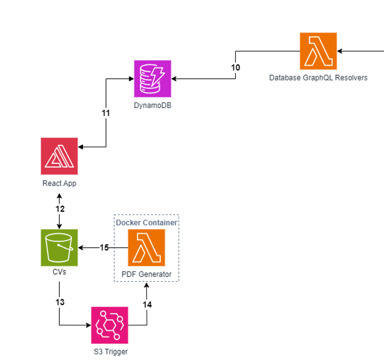

# CV Generation Deep Dive

The CV Generation workflow deals with the generation, upload/download, and storage of CVs for each PDF. This document details how the CV is regenerated, how the S3 bucket is partitioned to store the generated files, and how the system figures out if an existing CV needs to be regenerated.



## 1. CV Generation

In the web application, when the user selects a template, the application creates a Latex file containing data for all the sections included in the selected template. This .tex file is uploaded to the S3 Bucket (Step 12 in the diagram) using a presigned URL. As soon as the .tex file is uploaded to the bucket, an event is triggered which runs a Lambda function which converts the .tex file to a .pdf file and stores it in the same folder in the S3 bucket as the .tex file (Step 13, 14, and 15).

## 2. S3 Bucket Partitioning

The S3 bucket stores the files for each user. The bucket is partitioned using the following key structure.

```text
<cognito_user_id>/
├── <user_id>/
├   ├── <template_id>/
├   ├   ├── resume.pdf
├   ├   ├── resume.tex  
```

The above shows the key structure for a user's files. For example, a user's PDF CV will be stored at the key <cognito_user_id>/<user_id>/<template_id>/resume.pdf where:

* <cognito_user_id> -> The cognito user id of the user
* <user_id> -> The user id of the user (as stored in the database)
* <template_id> The template id of the CV template being accessed 

## 3. S3 Bucket Upload/Download Authorization

Upload/download to the S3 bucket needs to be authorized. One faculty member should not be able to access or change another's files. The Lambda function (GraphQL resolver) named getPresignedUrl is what allows this functionality.

The resolver accepts a JWT token. To access a key space starting with the key <cognito_user_id>/..., the JWT token passed to the resolver should be valid (and it is validated as part of the resolver logic) and the JWT token should belong to the same Cognito user that has id <cognito_user_id>. Only once this validation is done does the function return a presigned URL to the requested partition in the S3 bucket. This mechanism prevents unauthorized access. 

## 4. CV Regeneration

CV generation takes a few seconds and it is wasteful to upload a new file to the bucket, then wait for the PDF to be generated, and then get a URL to download it, everytime someone clicks on a template in the web app. To solve this problem, we use a DynamoDB table (Step 10 and 11) to store update logs. The key/value pair stored in the DynamoDB is logEntryId/timestamp.

The key logEntryId looks either like <cognito_user_id>/<user_id>/<template_id> or <cognito_user_id>/<user_id>. The value timestamp stores a UNIX timestamp, which is the timestamp of last update to the user data of the user with id <user_id> (in case of the key <cognito_user_id>/<user_id>) or that of last udate to a user section contained in the template <template_id> (in case of the key <cognito_user_id>/<user_id>/<template_id>). These timestamps are automatically updated by the GraphQL resolvers responsible for updating this data in the database. The application knows that a new CV needs to be regenerated if either the timestamp associated with <cognito_user_id>/<user_id>/<template_id> or <cognito_user_id>/<user_id> is newer than the time when the last PDF was created in that S3 partition.