# Deployment Guide

## Table of Contents
<!-- no toc -->
- [Requirements](#requirements)
   - [Accounts Requirements](#accounts-requirements)
   - [Software Requirements](#software-requirements)
- [Pre-Deployment](#pre-deployment)
   - [Create GitHub Personal Access Token](#create-github-personal-access-token)
   - [API Keys/Tokens](#api-keystokens)
- [Deployment](#deployment)
   - [Step 1: Fork \& Clone The Repository](#step-1-fork--clone-the-repository)
     - [Install Dependencies](#install-dependencies)
   - [Step 2: Upload Secrets](#step-2-upload-secrets)
   - [Step 3: Backend Deployment](#step-3-backend-deployment)
     - [1: Navigate to the cdk directory](#1-navigate-to-the-cdk-directory)
     - [2: Upload the Elsevier API Key, Institution Token, Database Secret and OPS API Key](#2-upload-the-elsevier-api-key-institution-token-database-secret-and-ops-api-key)
     - [3: CDK Deployment](#3-cdk-deployment)
   - [Taking down the deployed stacks](#taking-down-the-deployed-stacks)
   - [Step 4: Upload Data to S3 for the Bulk Data Pipeline](#step-4-upload-data-to-s3-for-the-bulk-data-pipeline)
   - [Step 5: Upload Data to S3 for the Grant Data Pipeline](#step-5-upload-data-to-s3-for-the-grant-data-pipeline)
   - [Step 6: Starting Patent Data Pipeline](#step-6-starting-patent-data-pipeline)
- [Post-Deployment](#post-deployment)
   - [Step 1: Build AWS Amplify App](#step-1-build-aws-amplify-app)
   - [Step 2: Add Redirect](#step-2-add-redirect)
   - [Step 3: Visit Web App](#step-3-visit-web-app)
- [Creating a User](#creating-a-user)
- [Activating User Self Sign up](#activating-user-self-sign-up)

## Requirements

### Accounts Requirements

- [AWS Account](https://aws.amazon.com/account/)
- [GitHub Account](https://github.com/)

### Software Requirements

Before you deploy, you must have the following softwares installed on your device. Please install the correct version of each software according to your machine's operating system.

- [AWS CLI](https://aws.amazon.com/cli/)
- [AWS CDK](https://docs.aws.amazon.com/cdk/v2/guide/cli.html) *(v2.122.0 > required)*
- [npm](https://docs.npmjs.com/downloading-and-installing-node-js-and-npm)
- [node](https://nodejs.org/en/learn/getting-started/how-to-install-nodejs) *(v20.0.0 > required)*
- [Docker Desktop](https://www.docker.com/products/docker-desktop/)
- [git](https://git-scm.com/downloads)

**Once you have downloaded docker desktop launch and setup the application. Once the application is setup leave it running.**

If you are on a Windows device, it is recommended to install the [Windows Subsystem For Linux](https://docs.microsoft.com/en-us/windows/wsl/install), which lets you run a Linux terminal on your Windows computer natively. Some of the steps will require its use. [Windows Terminal](https://apps.microsoft.com/store/detail/windows-terminal/9N0DX20HK701) is also recommended for using WSL.

## Pre-Deployment
### Create GitHub Personal Access Token
To deploy this solution, you will need to generate a GitHub personal access token. Please visit [here](https://docs.github.com/en/authentication/keeping-your-account-and-data-secure/managing-your-personal-access-tokens#creating-a-personal-access-token-classic) for detailed instruction to create a personal access token.

*Note: when selecting the scopes to grant the token (step 8 of the instruction), make sure you select `repo` scope.*

**Once you create a token, please note down its value as you will use it later in the deployment process.**

### API Keys/Tokens

The application interact with various third-party API, so it is vital to obtain those API keys/tokens and securely store them before moving forward with the deployment.

- Elsevier API Key and Institution Token obtainable via the [Elsevier Developer Portal](https://dev.elsevier.com/).
- European Patent Office's OPS API Key obtainable by following the instructions on the [Open Patent Services](https://developers.epo.org/) portal.

## Deployment
### Step 1: Fork & Clone The Repository
First, you need to fork the repository. To create a fork, navigate to the [main branch](https://github.com/UBC-CIC/grant-program-analytics) of this repository. Then, in the top-right corner, click `Fork`.


You will be directed to the page where you can customize owner, repository name, etc, but you do not have to change any option. Simply click `Create fork` in the bottom right corner.

Now let's clone the GitHub repository onto your machine. To do this:
1. Create a folder on your computer to contain the project code.
2. For an Apple computer, open Terminal. If on a Windows machine, open Command Prompt or Windows Terminal. Enter into the folder you made using the command `cd path/to/folder`. To find the path to a folder on a Mac, right click on the folder and press `Get Info`, then select the whole text found under `Where:` and copy with ⌘C. On Windows (not WSL), enter into the folder on File Explorer and click on the path box (located to the left of the search bar), then copy the whole text that shows up.
3. Clone the GitHub repository by entering the following command. Be sure to replace `<YOUR-GITHUB-USERNAME>` with your own username.
```
git clone https://github.com/<YOUR-GITHUB-USERNAME>/FacultyCV
```
The code should now be in the folder you created. Navigate into the root folder containing the entire codebase by running the command:
```
cd FacultyCV
```

#### Install Dependencies

Go into the cdk folder which can be done with the following command:

```
cd cdk
```

Now that you are in the cdk directory, install the core dependencies with the following command:

```
npm install
```

Go into the frontend folder which can be done with the following command:

```
cd ../frontend
```

Now that you are in the frontend directory, install the core dependencies with the following command:

```bash
npm install
```

### Step 2: Upload Secrets
You would have to supply your GitHub personal access token you created eariler when deploying the solution. Run the following command and ensure you replace `<YOUR-GITHUB-TOKEN>` and `<YOUR-PROFILE-NAME>` with your actual GitHub token and the appropriate AWS profile name.
```
aws secretsmanager create-secret \
    --name github-access-token \
    --secret-string "{\"github-token\":\"<YOUR-GITHUB-TOKEN>\"}"\
    --profile <YOUR-PROFILE-NAME>
```

Moreover, you will need to upload your github username to Amazon SSM Parameter Store. You can do so by running the following command. Make sure you replace `<YOUR-GITHUB-USERNAME>` and `<YOUR-PROFILE-NAME>` with your actual username and the appropriate AWS profile name.

```
aws ssm put-parameter \
    --name "facultycv-owner-name" \
    --value "<YOUR-GITHUB-USERNAME>" \
    --type String \
    --profile <YOUR-PROFILE-NAME>
```

### Step 3: Backend Deployment

It's time to set up everything that goes on behind the scenes! For more information on how the backend works, feel free to refer to the Architecture Deep Dive, but an understanding of the backend is not necessary for deployment.

#### 1: Navigate to the cdk directory
Navigate to the cdk directory in the repository using the following command.

```
cd cdk
```

#### 2: Upload the Elsevier API Key, Institution Token, Database Secret and OPS API Key

While in the `cdk` folder, run the following commands. Ensure you replace "INSTITUTION_TOKEN" in the first command with your own Elsevier institution token and you replace "API_KEY" in the second command with your own Elsevier API key.

```
aws ssm put-parameter --name "/service/elsevier/api/user_name/instoken" --value "INSTITUTION_TOKEN" --type SecureString --overwrite
aws ssm put-parameter --name "/service/elsevier/api/user_name/key" --value "API_KEY" --type SecureString --overwrite
```

You would also have to supply a custom database username when deploying the solution to increase security. Run the following command and ensure you replace `DB-USERNAME` with the custom name of your choice.

```
aws secretsmanager create-secret \
    --name facultyCV-dbUsername \
    --description "Custom username for PostgreSQL database" \
    --secret-string "{\"username\":\"DB-USERNAME\"}"
```

For example: you want to set the database username as "facultyCV"

```
aws secretsmanager create-secret \
    --name facultyCV-dbUsername \
    --description "Custom username for PostgreSQL database" \
    --secret-string "{\"username\":\"facultyCV\"}"
```

Similar to Elsevier API, you would have to obtain a consumer key and consumer secret key to be able to use the OPSv3.2 API. Store the secrets in Secret Manager by doing the following, replacing `CONSUMER_KEY` and `CONSUMER_SECRET_KEY` with the appropriate values:

```
aws secretsmanager create-secret \
    --name "facultyCV/credentials/opsApi" \
    --description "API keys for OPS" \
    --secret-string "{\"consumer_key\":\"CONSUMER_KEY\",\"consumer_secret_key\":\"CONSUMER_SECRET_KEY\"}"
```

#### 3: CDK Deployment

Initialize the CDK stacks, replacing `<YOUR_AWS_ACCOUNT_ID>`, `<YOUR_ACCOUNT_REGION>` and `<YOUR-PROFILE-NAME>`. with the appropriate values. Note this CDK deployment was tested in the `us-west-2` region only.

```bash
cdk synth --profile your-profile-name
cdk bootstrap aws://<YOUR_AWS_ACCOUNT_ID>/<YOUR_ACCOUNT_REGION> --profile <YOUR-PROFILE-NAME>
```

Deploy the CDK stacks:

**Note for deploying the PatentDataStack**: You must make a note of what the name of your institution appear on [Espacenet](https://worldwide.espacenet.com/patent/) or by working with a representative from the European Patent Office. We highly recommend working with a patent specialist to determine the exact name that represents your institution on Espacenet/EPO.

For example, it was determined that the EPO/Espacenet use "UNIV BRITISH COLUMBIA" to represent UNIVERSITY OF BRITISH COLUMBIA. 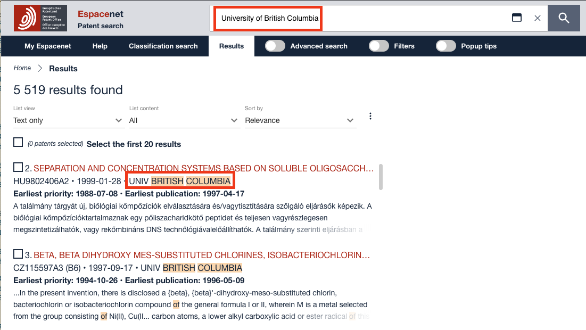

Thus you should do the following if you would like to deploy only the Patent Data Stack:

```
cdk deploy PatentDataStack --parameters PatentDataStack:epoInstitutionName="UNIV BRITISH COLUMBIA,UNIVERSITY OF BRITISH COLUMBIA" --profile <YOUR-PROFILE-NAME>
```

Note that the two name `"UNIV BRITISH COLUMBIA,UNIVERSITY OF BRITISH COLUMBIA"`  is separated by a comma, and there is **no space before or after the comma**.


You may run the following command to deploy the stacks all at once. Again, replace `<YOUR-INSTITUTION-NAME>` with the name that represents your instiution on Espacenet/EPO and`<YOUR-PROFILE-NAME>` with the appropriate AWS profile used earlier.

```
cdk deploy --all --parameters PatentDataStack:epoInstitutionName="<YOUR-INSTITUTION-NAME>" --profile <YOUR-PROFILE-NAME>
```

* Example:
   ```
   cdk deploy --all --parameters PatentDataStack:epoInstitutionName="UNIV BRITISH COLUMBIA,UNIVERSITY OF BRITISH COLUMBIA" --profile <YOUR-PROFILE-NAME>
   ```

#### Taking down the deployed stacks

To take down the deployed stack, navigate to AWS Cloudformation, click on the stack(s) and hit Delete.
Please delete the stacks in the opposite order of how they were deployed. The deletion order is as follows:

1. PatentDataStack
2. GrantDataStack
3. DataFetchStack
4. DbFetchStack
5. AmplifyStack
6. ApiStack
7. CVGenStack
8. DatabaseStack
9. VpcStack

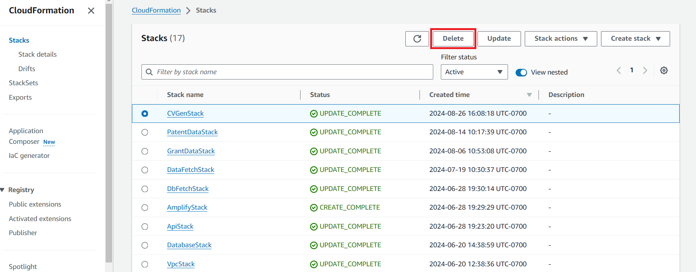

### Step 4: Upload Data to S3 for the Bulk Data Pipeline
   
1. First ensure you have all the CSV files needed to be put into the S3 bucket. Examples of how these files should be formatted can be found here: [Example CSV Files](sample_data). 
2. At the [AWS online console](https://console.aws.amazon.com/console/home), enter `S3` in the search bar.
   
3. In the `Buckets` search bar enter `datafetchstack` and click on the name of the bucket (the actual name will varies a bit, but will always contains `datafetchstack`).
   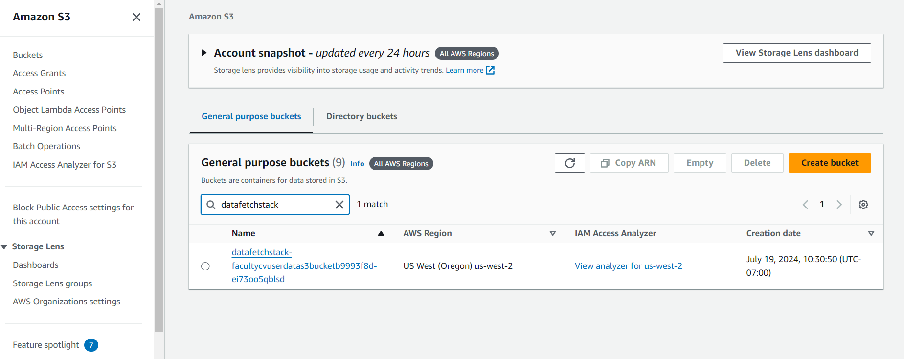
4. Click on the `user_data` folder then click `Upload`.
   
5. Click `Add Files` and select the `institution_data.csv`, `university_info.csv`, `data_sections.csv`, and `teaching_data.csv` files. Remember the names of these files must be exactly the same or the S3 trigger will not work. Click `Upload` to complete this process.
   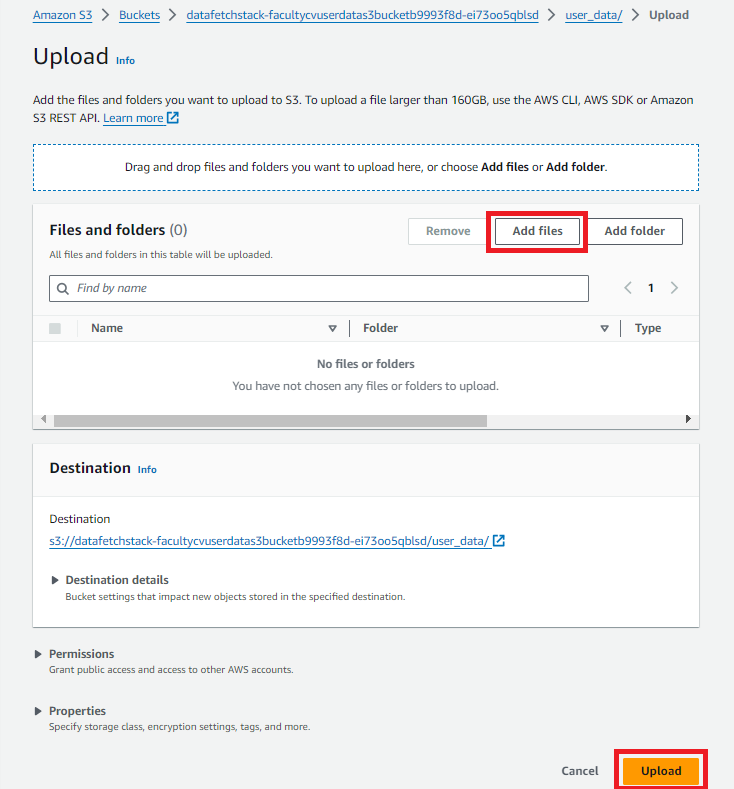
6.  Once the upload is complete click `Close`

### Step 5: Upload Data to S3 for the Grant Data Pipeline

1. Refer to the [User Guide to Grant Downloads](Grant_Downloads_User_Guide.pdf) for instructions on how to obtain the grant data for your institution. After obtaining the CSV files, double check your files with the [sample csv files](sample_grants_data/) labeled `sample_cihr.csv`, `sample_nserc.csv`, `sample_cfi.csv`, `sample_sshrc.csv`, `sshrc_program_codes.csv` and `sample_rise.csv`. Ensure that the format is similar to the sample files.
   
2. At the [AWS online console](https://console.aws.amazon.com/console/home), enter `S3` in the search bar. There are two buckets whose name contain grantdatastack. One contains the scripts for the glue jobs that run to clean and store the grant/patent data. The bucket you must upload your CSV files to is the `grantdatastack` bucket **without** `glues` in the name.
   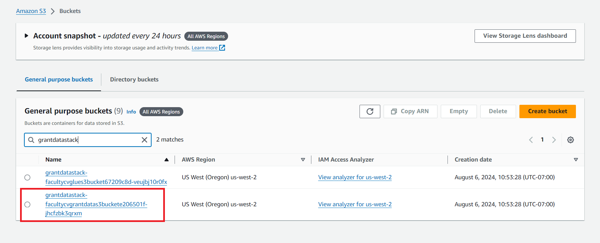


3. There are a folder called `raw` already created for you at deployment, and it contains 5 subfolders (`cihr`, `cfi`, `nserc`, `sshrc`, `rise`). Inside each of the subfolder, upload the corresponding CSV file for that grant there. For SSHRC, please also remember to include the `sshrc_program_codes.csv` file along with the SSHRC grant data CSV file. The resulting folder structure should look like this:

```text
raw/
├── cihr/
│   └── your-cihr-file.csv
├── nserc/
│   └── your-nserc-file.csv
├── sshrc/
│   ├── your-sshrc-file.csv
│   └── sshrc_program_codes.csv
├── cfi/
│   └── your-cfi-file.csv
└── rise/
    └── your-rise-file.csv
```


**NOTE**: 

+ If you found out that you there was a mistake in the uploading process, either you put the wrong files in the wrong folders, or there were extra files uploaded accidentally, then you should **delete the wrong file** then **wait for 20 minutes and redo the uploading process**. 
+ In the extremely unlikely situation that you do not see the `raw` folder and its 5 subfolders automatically created during **first-time deployment**, you can also manually create the `raw` folder first, then the 4 subfolders inside.


4. If the uploading process was performed correctly, the Grant Data Pipeline will automatically be invoked and the new data will show up in the RDS PostgreSQL database after around 20 min or so.

5.  After around 20 minutes, navigate to the S3 bucket that you uploaded the grant earlier. If you're still having that page open, simply refresh the page. If this Grant Data Pipeline has successfully executed, you should see another folder called **clean** being added in addition to your **raw** folder.
   

6.  By going into this new folder, you should see that it has a **similar subfolder structure to raw**. You dont have to do anything further.
   

7.  If you see that a folder(s) is missing. Please wait for another 10 or so minutes because this could be a latency issue. If you came back and check and that missing folder still has not show up, then it is possible that a wrong file was uploaded in **raw** folder. Please double check your **raw** folder and follow the instructions above to reupload accordingly.

### Step 6: Starting Patent Data Pipeline

1. On AWS Console, search and navigate to AWS Glue
   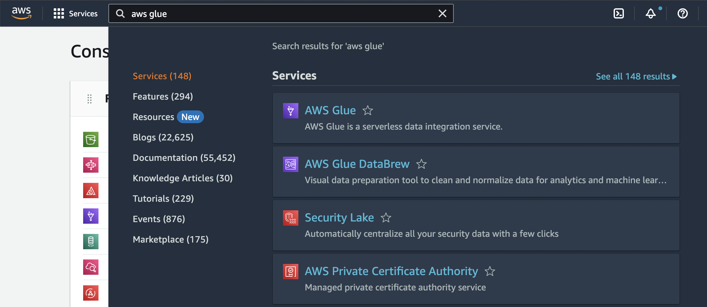

2. Navigate to ETL jobs > Visual ETL
   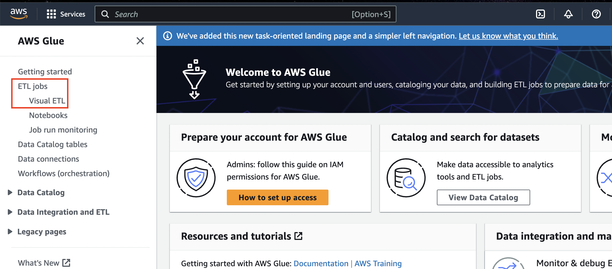

3. Search for a Glue job that contains the string `fetchEpoPatents`.

4. Tick the box next to it and click `Run job`.
   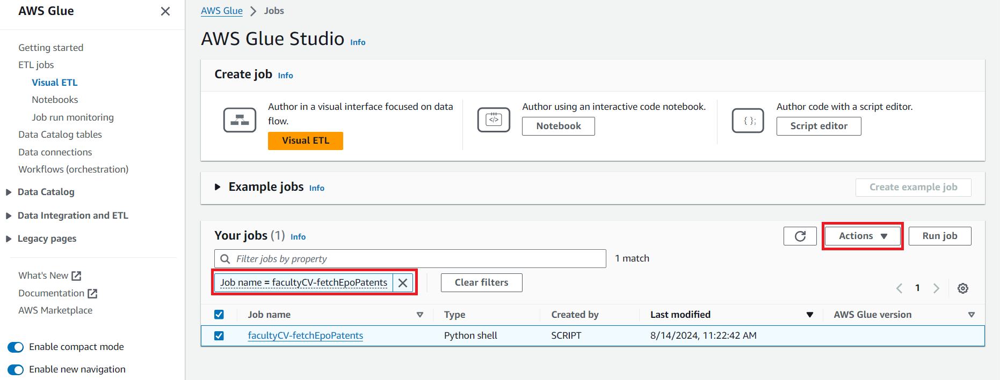

5. No further action is needed. This will execute the entire pipeline. This takes roughly 15 minutes.

**NOTE**: You would have to run the steps above for first-time deployment. **The Patent Data Pipeline** is scheduled to run on every month on the 1st and 15th day (twice a month).

## Post-Deployment

### Step 1: Build AWS Amplify App

Log in to AWS console, and navigate to **AWS Amplify**. You can do so by typing `Amplify` in the search bar at the top.
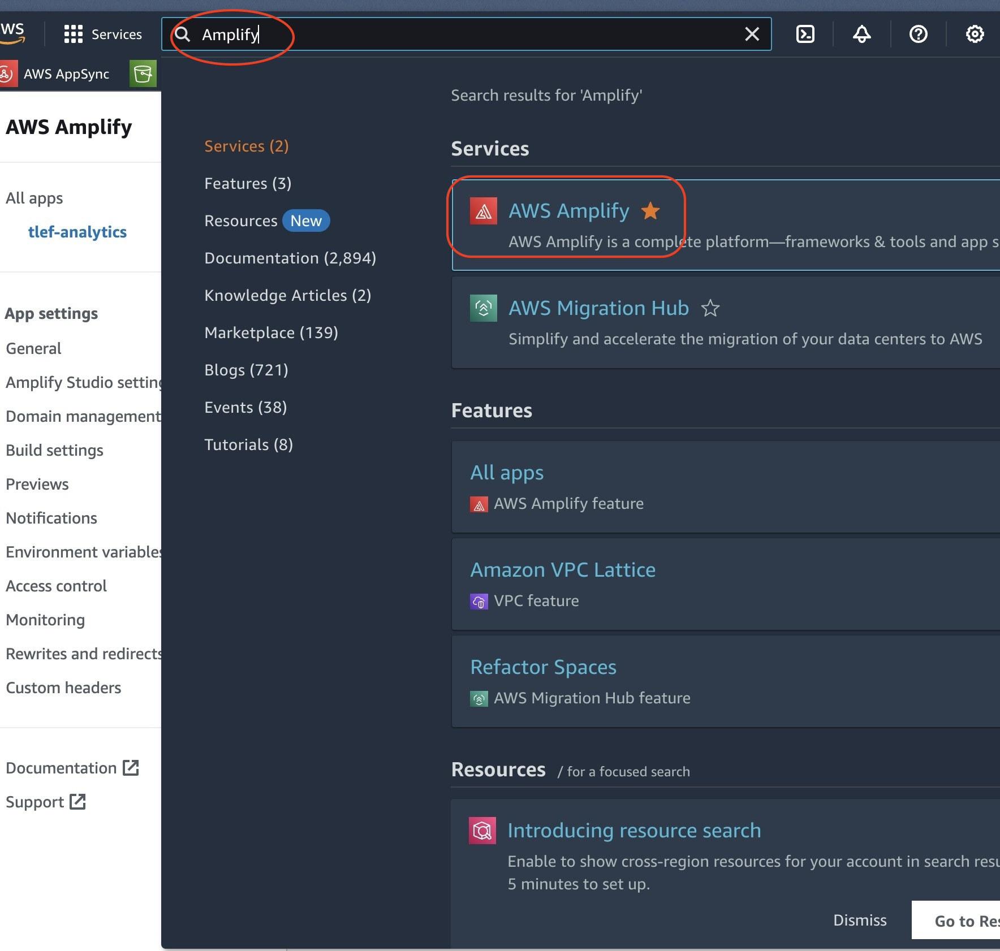

From `All apps`, click `faculty-cv-amplify` to go to the app settings. Note down the App ID.\


You may run the following command to build the app. Please replace `<APP-ID>` with the app ID found in amplify and `<PROFILE-NAME>` with the appropriate AWS profile used earlier. 
```
aws amplify start-job --job-type RELEASE --app-id <APP-ID> --branch-name main --profile <PROFILE-NAME>
```
This will trigger the build. 
When the build is completed, you will see the screen as shown in the below image.
Please note down the URL highlighted in red, as this will be the URL of the web application.


### Step 2: Add Redirect

Click on `Hosting` in the left taskbar and click on `Rewrites and redirects`.

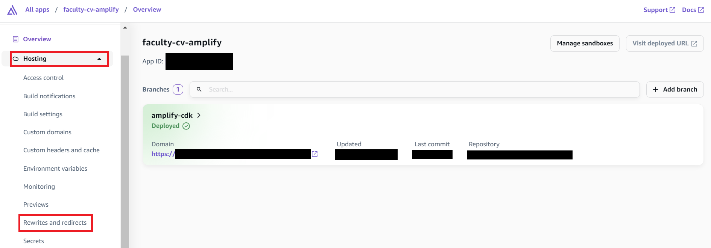

Here click on `Manage redirects` and then `Add Rewrite` to add a redirect with: 
- Source Address:
`</^[^.]+$|\.(?!(css|gif|ico|jpg|js|png|txt|svg|woff|woff2|ttf|map|json|webp)$)([^.]+$)/>`
- Target Address: `/`
- Type: `404 (Redirect)`


And then click `Save`.
Refer to [AWS's Page on Single Page Apps](https://docs.aws.amazon.com/amplify/latest/userguide/redirects.html#redirects-for-single-page-web-apps-spa) for further information on why we did that.

### Step 3: Visit Web App
Now you can navigate to the URL you created in step 1 to see your application in action.

## Creating a User

To set up a user account on the app, you will need to do the following steps:

1. At the [AWS online console](https://console.aws.amazon.com/console/home), enter `Cognito` in the search bar.
   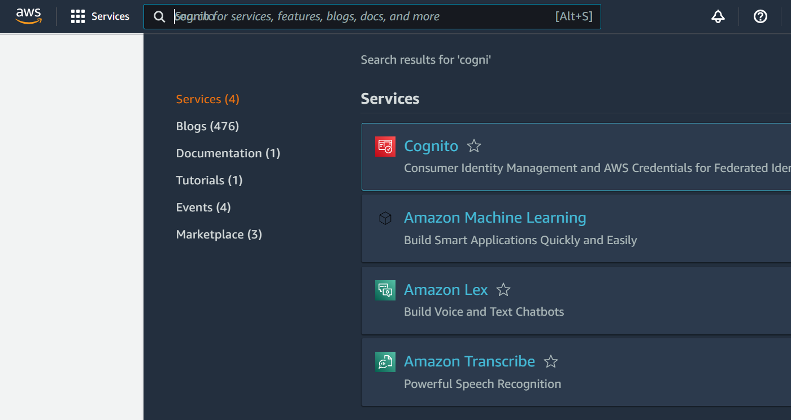
2. Click `User Pools` from the left hand sidebar and select the user pool `faculty-cv-user-pool`.
   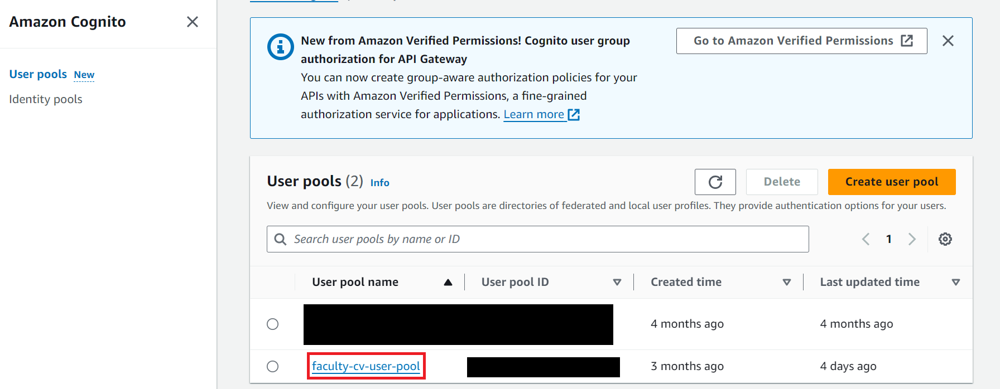
3. Click the `Users` tab, then click `Create User`.
   
4. For Invitation message, select `Send an email invitation`. Then fill in the user's email address in the Email address text field below and select the `Mark email address as verified`. For Temporary password, select `Generate a password`. Then click `Create User`.
   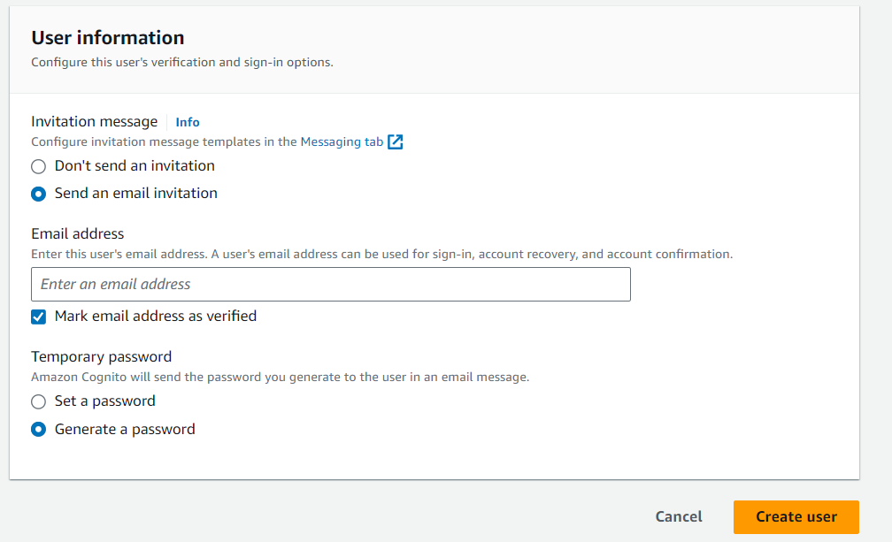
5. The user will receive an email to the email address that was previously entered containing their temporary password.
   
6. When the user enters their email and temporary password on the sign in page of the app, they will then be prompted to replace their temporary password by setting a new password and choosing the role they want for the account.
7. The new user account has been created!

**Note:**
The first Admin must be made manually through Cognito, but after that the Admin is able to make any user an Admin or Department Admin through the application once they have signed up if user self sign up is enabled. Department Admins can make other users in their department a Department Admin for their department as well. 

## Activating User Self Sign up

1. Navigate back to same user pool in the previous step on the Cognito Console, click on `Sign-up experience`.
 
1. In order to activate self sign up, the `Self-registration` option must be enabled. If it is not, simply click the `Edit` button and enable the feature. This allow users to create their own accounts.
 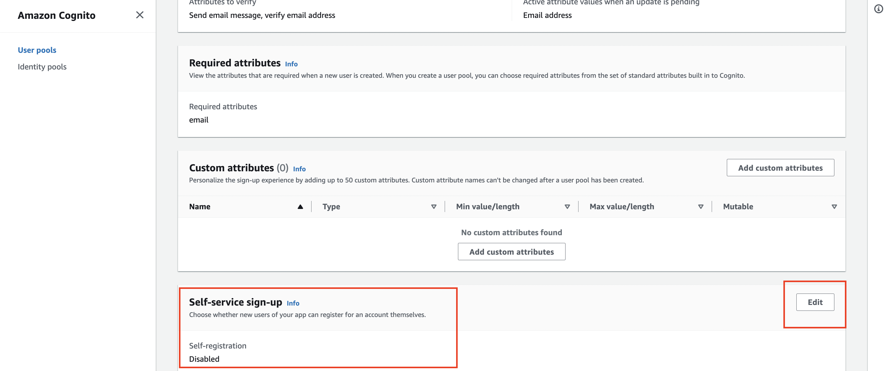