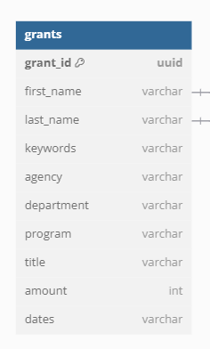

# Grant Data Pipeline Deep Dive

The goal of the Grant Data Pipeline is to initially populate the database with grant data, currently from 4 different external grant sources:

1. Canadian Institutes of Health Research (**CIHR**)
2. Natural Sciences and Engineering Research Council of Canada (**NSERC**)
3. Social Sciences and Humanities Research Council (**SSHRC**)
4. Canada Foundation for Innovation (**CFI**)

As well as the data provided by UBC:

1. Research Information Systems (**RISe**)

***


For the pipeline to run, currently a total of 6 Comma-Separated-Value (CSV) files need to be uploaded to the designated S3 bucket with the proper folder structure. Detailed on how to perform this part is outlined in the [User Guide to Grant Downloads](User%20Guide%20to%20Grant%20Downloads.pdf) or [Step 6 in the Deployment Guide](DeploymentGuide.md#step-6-upload-data-to-s3-for-the-grant-data-pipeline). Assuming the uploading process is done correctly, the entire pipeline will automatically run from start to end without needing further user intervention (unless there is an error).

This document will show exactly how that is achieved.

## 1. S3 Object Upload Event Notification

`raw` folder structure:

```text
raw/
├── cihr/
│   └── your-cihr-file.csv
├── nserc/
│   └── your-nserc-file.csv
├── sshrc/
│   ├── your-sshrc-file.csv
│   └── sshrc_program_codes.csv
├── cfi/
│   └── your-cfi-file.csv
└── rise/
    └── your-rise-file.csv
```

Amazon S3 Bucket has a functionality called Event Notification. Whenever a user Uploads/Delete/Copy a file inside a Bucket, they can set up an event notification that lets the bucket communicate with other cloud event services (SQS, SNS, Lambda). For this pipeline, S3 was set up a notification specifically for s3:ObjectCreated:PUT event, so that whenever the user uploaded the data, S3 will notify a Lambda function via Event Notification.

## 2. Lambda Function mapping event to the correct Glue job

### 2.1 Why do the folders follow a naming convention?

Lambda function is the event receiver and the "orchestrator" of the pipeline. The Function will always listen to uploading events originating from the **raw** folder first since it is the first folder to be created (uploaded by the user). The lambda then filters out what subfolders are contained inside **raw** then it always invokes the corresponding `clean-...`. For example, if the **raw** folder only contains 2 subfolders **cihr** and **nserc** along with the CSV files inside each, then the Lambda function will invoke the `clean-cihr` and `clean-nserc` Glue jobs. The Lambda function parses the exact name of the subfolder (case sensitive) to determine the Glue job to call, so if there is a subfolder called *new_grant_source* then it would also need a corresponding Glue job with the name `clean-new_grant_source` to clean the data. That is why a strict naming convention for subfolders at the initial upload was enforced.

### 2.2 Sequential invocations

After the Lambda function invoked the `clean-...` Glue jobs, they will create a temporary file that will be stored in the same S3 Bucket under the `clean` folder, with the same subfolders structure (5 subfolders). S3 event notification is also configured for this folder, and Lambda will invoke the next Glue Job called `storeData` 5 times. In other words, the Lambda function listens to S3 notifications to orchestrate the Glue jobs in sequential order (clean -> store in database).

## 3. Data Cleaning

Currently, there are 5 different grant datasets, each with different schemas (columns). Each CSV dataset needs to be processed differently, but ultimately they need to end up with the same schema as the grant_data table that was set up in the PostgreSQL database to store the processed grant data.


Thus, there are 5 different Glue jobs called `clean-cihr`, `clean-nserc`, `clean-sshrc`, `clean-cfi`and `clean-rise` to clean each corresponding grant CSV data, since again each raw dataset has a different encoding format and schemas. They are using a powerful Python tabular-data library called [Pandas](https://pandas.pydata.org/docs/index.html) to manipulate the data. The cleaning process involves stripping off special characters, reformatting datetime encoding, trimming white space and splitting each researcher's name into first name and last name. The results will then be stored in the same S3 bucket under the `clean` folder, with the same subfolder structure as `raw`. This step ensures that all 5 datasets will have the same schema and that the data in each column are formatted the same way for the next step.

## 4. Store data

The data is now processed and ready to be imported into the database under the `grants` table.

### Relational Table Update in the PostgreSQL Database

For this new implementation to work, a new `grants` table is created.



### 4.1 `grants` table

| Column Name | Description | Source |
| ----------- | ----------- | ------ |
| grant_id | the **unique ID** associated with each grant record | generated internally by the PostgreSQL Database Engine |
| first_name | the researcher's first name | CSV files |
| last_name | the researcher's last name | CSV files |
| keywords | the keywords associated with that project | CSV files |
| agency | the granting agency (currently only CIHR, NSERC, SSHRC, CFI or RISE)| CSV files |
| department | the department of the researcher | CSV files |
| program | the specific program that the researcher applied for and was awarded the grant | CSV files |
| title | the title of a researcher's project | CSV files |
| amount | the amount of grant awarded (in dollars) | CSV files |
| year | the fiscal year | CSV files |
| dates | the start date (effective date) of the grant - end date (expiry date) of the grant | CSV files |