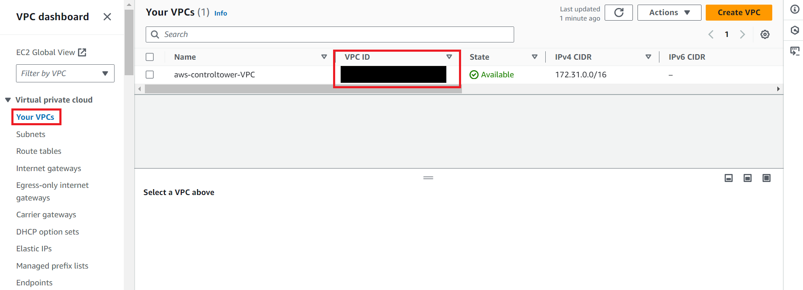

# Hybrid Cloud Deployment Guide

## 3a: CDK Deployment in Hybrid Cloud Environment

This section outlines the steps to deploy the application in a **hybrid cloud environment**. If you do not have an existing VPC, proceed to 3b: CDK Deployment in the [Deployment Guide](/docs/DeploymentGuide.md).

### Prerequisites
Ensure you have access to the **aws-controltower-VPC** and the name of your **AWSControlTowerStackSet**.

### Step-by-Step Instructions

1. **Modify the VPC Stack:**
   - Navigate to the `vpc-stack.ts` file located at `cdk/lib/vpc-stack.ts`.
   - Replace **line 13** with your existing VPC ID:
     ```typescript
     const existingVpcId: string = 'your-vpc-id'; //CHANGE IF DEPLOYING WITH EXISTING VPC
     ```
     You can find your VPC ID by navigating to the **VPC dashboard** in the AWS Management Console and locating the VPC in the `Your VPCs` section.

     

2. **Update the AWS Control Tower Stack Set:**
   - Replace **line 21** with your AWS Control Tower Stack Set name:
     ```typescript
     const AWSControlTowerStackSet = "your-stackset-name"; //CHANGE TO YOUR CONTROL TOWER STACK SET
     ```
     You can find this name by navigating to the **CloudFormation dashboard** in AWS, under `Stacks`. Look for a stack name that starts with `StackSet-AWSControlTowerBP-VPC-ACCOUNT-FACTORY`.

     

### Deployment Changes

In this deployment, the following have been modified in the existing VPC stack to ensure compatibility with a hybrid cloud setup:

- **VPC Identification:** Instead of creating a new VPC, an existing VPC is now utilized by passing its ID into the `VpcStack` configuration.
- **Private and Isolated Subnets:** Private and isolated subnet IDs and their associated route table IDs are imported using AWS Control Tower.
- **Interface Endpoints:** Multiple AWS service endpoints (SSM, Secrets Manager, RDS, Glue) are added within isolated subnets to maintain secure access in the hybrid environment.
- **Public Subnet and Internet Gateway:** A public subnet and an internet gateway are created, which are essential for NAT Gateway operations.
- **NAT Gateway:** A NAT gateway is created in the public subnet.
- **Private Subnet Route Tables:** For each private subnet's route table, a route to the NAT gateway is added to provide internet access to resources in private subnets

These changes ensure the application seamlessly integrates into the existing VPC while preserving private and secure connectivity within a hybrid cloud environment.