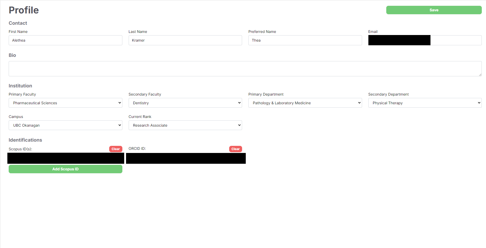
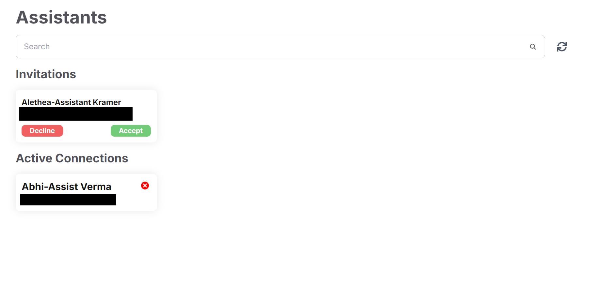
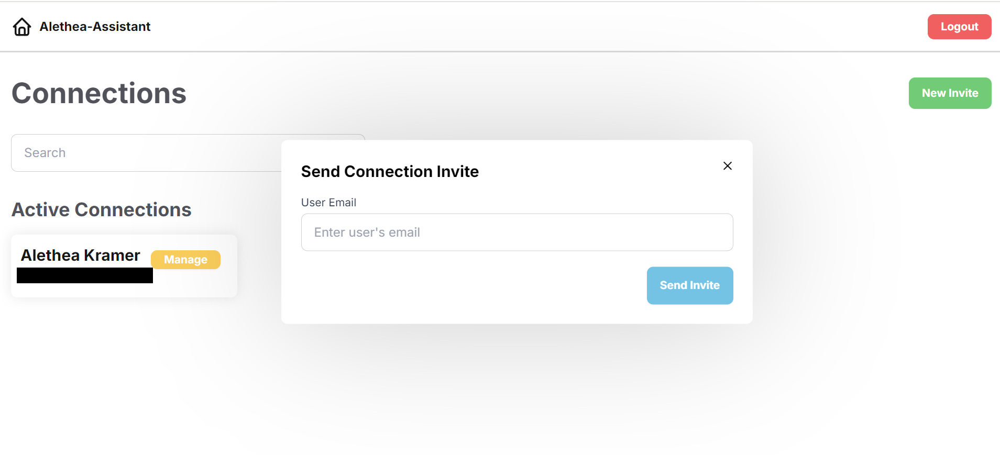
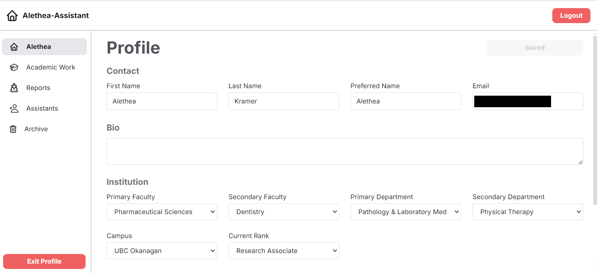

# Faculty CV User Guide

## Table of Contents
<!-- no toc -->
- [Overview](#overview)
  - [Purpose](#purpose)
  - [Key Features](#key-features)
  - [User Roles](#user-roles)
  - [Basic Navigation Tips](#basic-navigation-tips)
- [Role-Based Access](#role-based-access)
  - [Faculty Role](#faculty-role)
    - [Profile](#profile)
    - [Academic Work](#academic-work)
    - [Reports](#reports)
    - [Assistants](#assistants)
    - [Archive](#archive)
  - [Assistant Role](#assistant-role)
    - [Connections](#connections)
  - [Admin Role](#admin-role)
    - [Users](#users)
    - [Analytics](#analytics)
    - [Templates](#templates)
    - [Sections](#sections)
    - [Archived Sections](#archived-sections)
  - [Department Admin Role](#department-admin-role)
    - [Users](#users-1)
    - [Analytics](#analytics-1)
    - [Templates](#templates-1)
- [Common Features](#common-features)

## Overview

Welcome to the Faculty CV digital platform, a solution developed by the UBC CIC team in collaboration with the UBC Faculty of Medicine. This platform is designed to streamline the process of creating and managing UBC-standardized Curriculum Vitae (CV) for faculty members, enhancing operational efficiency and reducing administrative burdens.

### Purpose

The primary objective of this platform is to centralize and standardize the collection and management of academic outputs, allowing faculty members to generate CVs with greater ease and consistency. By integrating data from various internal and external sources, the platform reduces the time and effort required to compile CVs, thereby enabling faculty members to focus on their core responsibilities, such as research, teaching, and clinical duties.

### Key Features

- **Centralized Data Repository:** Faculty members can access and integrate their academic output data into a single, digital repository, simplifying the CV creation process.
- **UBC-Standardized CV Generation:** The platform allows faculty to easily generate CVs that meet UBC's standardized requirements, which can be used for various academic and professional purposes.
- **Delegation of Tasks:** Faculty members can delegate data entry and profile management tasks to designated assistants, streamlining administrative processes.
- **Data Insights:** Department heads, research directors, and faculty leadership can access detailed reports on faculty activities, supporting strategic planning and decision-making.

### User Roles

The platform is designed to accommodate various user roles, each with specific permissions and functionalities:

- **Faculty Members:** Create, manage, and update their academic profiles and generate standardized CVs.
- **Assistants:** Support faculty members by managing data entry and profile updates.
- **Department Admins:** Oversee the management of faculty data within their department, generate reports, and coordinate faculty activities.
- **Admins:** Administer the platform, manage user roles and permissions, and ensure the smooth operation of the system.

### Basic Navigation Tips

The platform features an intuitive interface that guides users through the process of managing their academic work records and generating reports. Key concepts to understand include:

- **Academic Work Records:** These records store your professional and academic activities in the cloud. Examples of sections include:
  - **Teaching:** Covers activities like courses taught and student supervision.
  - **Publications:** Includes your scholarly publications and other academic contributions.
  - **Service to the Community:** Encompasses activities such as memberships on committees and editorial work.

  Entries within these sections can either be manually entered or automatically pulled from external data sources, such as Scopus or the European Patent Office.

- **Reports:** These are the outputs that translate your academic work records into formatted PDFs, useful for various academic and professional purposes.

- **Templates:** Templates define the structure of the reports, specifying which sections of your academic work records are included and the order in which they appear.

- **Archiving and Deletion:** Any deleted entry is moved to an archive, where it can be restored within three months. After this period, it is permanently deleted.

For more detailed instructions on using these features, refer to the relevant sections of this guide based on your assigned role.

## Role-Based Access
### Faculty Role

Faculty members have access to various tools and features to manage their academic responsibilities. Below is a breakdown of the key pages and their functionalities.

#### Profile

- **Basic Profile Information:** Faculty members should configure essential information, such as first and last name, Scopus ID, and ORCID ID, to enable automatic data fetching. 
  - **Scopus and ORCID IDs:** These identifiers are found in public databases and can be clicked on to verify the faculty member's identity.
- **Manual Saving:** All changes made to the profile must be manually saved by clicking the save button to ensure updates are retained.

#### Academic Work

- **Navigation:** Users can navigate through their academic work records using the search bar and can add or remove categories of academic work sections using filter buttons.

- **Managing Sections:** Each section allows users to review, archive, and edit entries. 
  - **External Data Sources:** Certain sections, like **Patents**, **Secure Funding**, **Publications**, **Education**, **Employment** and **Courses Taught**, use external datasets (ORCID, Scopus, etc.) to fetch data.
  
  - **Pop-Up Explanations:** When fetching data from external sources, a pop-up will explain the sources and allow the user to add any relevant entries.

- **Entry Management:** Under each entry, users have options to archive, edit (if editable), or view the entry. Entries can also be searched within each section.

#### Reports

- **Templates:** A list of report templates configured by system admins will appear. 
- **Generating Reports:** By clicking on any template, the system generates a corresponding PDF and previews it on the screen.
  - **Download Option:** Users can download the generated PDF to their local computer by clicking the download button.
- **Template Structure:** Templates specify which academic work sections are included in the report and in what order they appear.

#### Assistants

- **Managing Assistant Access:** This page is dedicated to managing assistant access to the faculty profile.
  - **Full Control:** Assistants who are granted access have full control over the faculty profiles they manage.
  - **Invitations:** This is where invitations for assistant access will appear, and they can be accepted or declined.
  - **Deactivating Connections:** Active connections can be deactivated by clicking the red "x" next to the assistant's name.

#### Archive

- **Archived Entries:** Any entry from any academic section that has been archived will appear here.
  - **Restoring Entries:** Archived entries can be restored immediately by clicking the restore icon.
  - **Retention Period:** Entries will remain in the archive for three months before being permanently deleted.
- **Search Functionality:** Archived sections can be searched to quickly locate specific entries.

### Assistant Role

Assistants play a crucial role in supporting faculty members by managing their profiles, academic work entries, and generating reports on their behalf. Below is an overview of how assistants can establish and manage connections with faculty members.

#### Connections

- **Landing Page:** The landing page for assistants is where they can view, create, and manage their connections with faculty members.
- **Inviting a New Connection:** Assistants can invite a faculty member to connect by sending an invitation via email.
  - **Faculty Acceptance:** Faculty members will receive these invitations within the app under the Assistants tab and can accept them there.
- **Faculty View:** Once a connection is accepted, assistants gain access to the faculty member’s profile and can:
  - **Edit Profile:** Update and maintain the faculty member's personal and professional information.
  - **Manage Academic Work:** Add, review, and manage academic work entries on behalf of the faculty member.
  - **Generate Reports:** Create and preview reports based on the faculty member's academic work records.
- **Assistant Header:** Assistants will always see a header at the top of the page identifying their role, with an option to log out.
- **Faculty Identification:** The left side menu will display the name of the faculty member they are working on behalf of, with an option to exit the faculty profile without logging out of the entire system.

### Admin Role

Admins are responsible for managing users, coordinating departmental activities, overseeing system-wide settings, and configuring report templates. Below is an overview of the common pages and functionalities available to admins.

#### Users

- **Viewing Users:** Admins can view all users within the platform.
- **Search and Filters:** Users can be searched and filtered by type (e.g., Faculty, Assistant, Admin) or department.
- **Managing Roles:** Admins have the ability to change user roles, granting or restricting access as needed.
  - **Adding Connections:**
    - For Faculty members, admins can add a new assistant who will have access to the faculty member's profile.
    - For Assistants, admins can add a new faculty connection that they can manage.
   

#### Analytics

- **Overview of Metrics:** Admins have access to a dashboard displaying key metrics such as:
  - **Total Users:** The overall number of users on the platform.
  - **Faculty Users:** Number of faculty members.
  - **Assistant Users:** Number of assistants.
  - **Department Admin Users:** Number of departmental admins.
  - **Admin Users:** Number of super admins.
  - **Users who Generated CVs:** The total number of users who generated CVs.
  - **User Growth Over Time:** A timeline showing the growth in the number of users.
- **Filtering Analytics:** Admins can filter analytics data by role or department using the menu at the top of the page.
  - **Departmental Limitations:** Departmental Admins can only view analytics data relevant to their department.
 

#### Templates

- **Configuring Templates:** Admins can create, edit, and manage report templates that define the structure of CVs and other reports generated by the system.
  - **Template Structure:** A template specifies which academic work sections are included in a report, in what order they appear and the range of years from which they want the CV data.
  - **Managing Templates:** Existing templates can be adjusted to change the included sections, their order, the range of years or they can be deleted.
  - **Creating New Templates:** New templates automatically include all sections initially. Admins can toggle sections on or off with the x or check buttons, and reorder sections by drag-and-drop. Each new template should be named descriptively.

  - **Report Formatting:** Allows generation of custom CV formats by editing the Vertical Spacing and Margin Size.
 

#### Sections

- **Managing Sections:** Existing sections can be managed to add new fields/attributes or deleted.
  - **Note:** An existing field/attribute within a section cannot be deleted.
- **Adding New Sections:** New sections can be created to describe a new type of activity that will appear under the academic work page for faculty users.
  - **Adding Attributes:** Any number of attributes can be added to a section, and they should be descriptive to ensure clarity.
 

#### Archived Sections

- **Restoring Archived Sections:** Any deleted section will appear under the archived sections page and can be restored immediately. Archived sections are not visible to faculty users.
- **Permanent Archiving:** Sections remain in the archive indefinitely and are never permanently deleted.

### Department Admin Role

Department Admins are responsible for managing users in their department, overseeing system-wide settings, and configuring report templates. Below is an overview of the common pages and functionalities available to department admins. Every Department admin is also a Faculty Member.

#### Users

- **Viewing Users:** Department Admins can view all users within their department.
- **Search and Filters:** Users can be searched and filtered by type (e.g., Faculty, Assistant, Admin).
- **Managing Roles:** Department Admins have the ability to change user roles, granting or restricting access as needed.
  - **Adding Connections:**
    - For Faculty members, admins can add a new assistant who will have access to the faculty member's profile.
    - For Assistants, admins can add a new faculty connection that they can manage.
   

#### Analytics
The Analytics page has the same metrics as the Admin, which can be found [here](#analytics) but the visualizations are for each department on specific data based on information across the whole faculty.

#### Templates
The Templates page has the same view and functionalities as the Admin for now, which can be found [here](#templates)

#### Toggle button Faculty <-> Admin view
The toggle button functionality in the navigation panel for Department Admins allows them to switch to faculty view, where they can access the functionality available to Faculty members, which can be found [here](#faculty-role)

## Common Features

This section outlines features accessible to all roles, ensuring a consistent and user-friendly experience across the platform.

- **Navigation Panel:** 
  - Navigation throughout the platform is facilitated by a panel on the left side of the screen. This panel automatically expands and collapses, allowing users to easily move between different sections of the app and sign out when needed.

- **Search and Filtering:**
  - Most content within the platform can be efficiently searched or filtered using the search bar. Additionally, toggle buttons are available to include or exclude specific items or categories, helping users quickly locate the information they need.

- **Pop-ups:**
  - Pop-ups are commonly used across the platform for tasks such as retrieving data from the database or managing connections between users. These pop-ups provide a streamlined way to interact with the system without leaving the current page.

